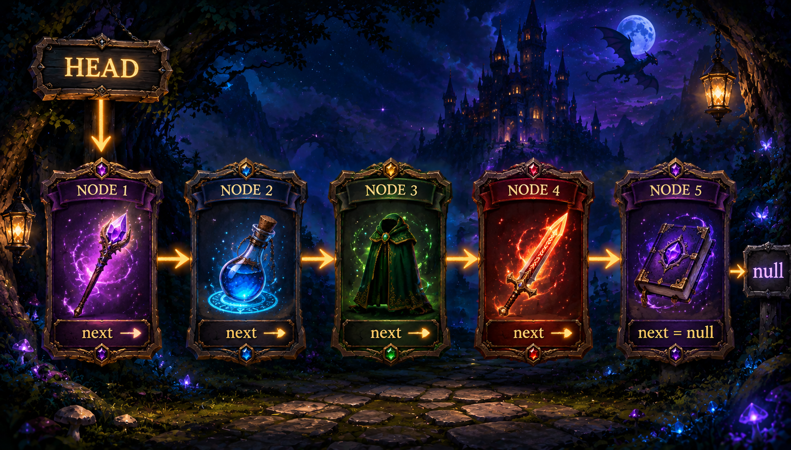

# Linked List Diagram

## What is a Linked List?

A **Linked List** is a collection of **Nodes** connected together in a chain.



### Explanation

The computer starts at the **Head**, which points to the first node in the linked list **(Magic Wand)**.

It reads the value stored in the current node, then follows the **`next` pointer** to move to the next node.

The computer continues this process **one node at a time**:

```text
Head
  ↓
🪄 Magic Wand
  ↓
🫥 Invisibility Cloak
  ↓
🔥 Flaming Sword
  ↓
📖 Spellbook
  ↓
null
```

For example:

1. **Head** points to the **Magic Wand**.
2. The computer reads `"Magic Wand"`.
3. It follows `next` to the **Invisibility Cloak**.
4. It reads `"Invisibility Cloak"`.
5. It follows `next` to the **Flaming Sword**.
6. It reads `"Flaming Sword"`.
7. It follows `next` to the **Spellbook**.
8. It reads `"Spellbook"`.
9. The Spellbook's `next` is **`null`**.
10. The computer stops because there are no more nodes.

Because linked lists **do not use indexes**, the computer cannot simply jump directly to the Spellbook. It must follow each `next` pointer in order to reach it.

### 🧠 Simple Way to Remember

> **Start at Head → Read the value → Follow `next` → Repeat → Stop at `null`.**
